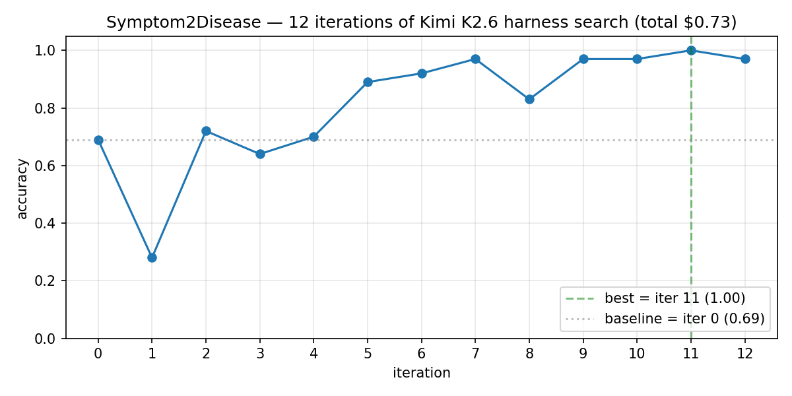

# mini-meta-harness

A budget reproduction of **Meta-Harness**
([arXiv:2603.28052](https://arxiv.org/abs/2603.28052)) that swaps the paper's
Claude Opus 4.6 proposer for **Kimi K2.6** via Moonshot's
Anthropic-compatible API. 12 iterations on Symptom2Disease for under $15.



**Headline result** (run `2026-04-23_17-21-21`, 100 held-out examples):
baseline **0.69 → best 1.00** at iteration 11, total spend **$0.73** —
about 5% of the $15 budget. Full breakdown, per-iteration cost, best-harness
source, and baseline-vs-best confusion matrix are in
[`notebooks/explore_run.ipynb`](notebooks/explore_run.ipynb).

Open items are in [`QUESTIONS.md`](QUESTIONS.md).

## TL;DR

Meta-Harness is an outer loop that searches over **harness code** — the
Python wrapper around an LLM that decides what to prompt, retrieve, and
parse. A coding-agent proposer has filesystem access to every prior harness,
its score, and its raw per-example traces; it reads them and writes a better
one. This repo reimplements that loop small enough to fit a portfolio budget,
with clean on-disk traces a downstream visualizer can consume.

Interactive replay → [harness.xyz](https://harness.xyz)

## Quickstart

```bash
uv sync --extra dev --extra notebook          # install
cp .env.example .env && $EDITOR .env          # MOONSHOT_API_KEY=...
uv run mmh run --iterations 3 --mock          # end-to-end, no API calls
uv run mmh run --iterations 12                # the real thing (~$0.75–$15)
uv run jupyter lab notebooks/explore_run.ipynb  # inspect the run
```

## CLI

```bash
mmh run --iterations 12                         # full run
mmh run --iterations 3 --mock                   # canned responses, no API
mmh run --iterations 12 --target-model claude-haiku-4-5  # cross-provider
mmh summary runs/2026-04-23_17-21-21            # print a past run
mmh cost runs/2026-04-23_17-21-21               # cost breakdown
```

## Results

First full 12-iteration run, run id `2026-04-23_17-21-21`:

| iter | accuracy | notes |
|---:|---:|---|
| 0 | 0.69 | zero-shot baseline |
| 1 | 0.28 | proposer spots `dengue` missing from labels; rewrites the whole prompt and over-corrects |
| 2 | 0.72 | narrower edit, keeps the dengue fix, recovers |
| 5 | 0.89 | rule-based post-corrections begin (model predicts X + input contains Y → rewrite to Z) |
| 7 | 0.97 | |
| **11** | **1.00** | 3 pinpoint rules targeting iter-10's remaining failures (distorted vision → migraine, "muscles pain" → dengue, "trouble seeing" → migraine) |
| 12 | 0.97 | one new regression — best-iteration isn't always last |

**Total cost**: $0.73 across 13 iterations. 76% of that was proposer-side
(176k input, 61k output tokens); the target model only burned 197k input /
33k output tokens running the actual classifier. That ratio — proposer
context dominates — is the same pattern the paper reports.

The notebook ([`notebooks/explore_run.ipynb`](notebooks/explore_run.ipynb))
renders the accuracy-per-iteration chart above, a per-iteration cost stack,
the full iteration-11 harness source, and a baseline-vs-best confusion
matrix showing which failure modes disappeared.

## How it works

Iteration 0 evaluates a fixed **zero-shot baseline harness**
(`src/mini_meta_harness/harnesses/baseline_zero_shot.py`) over 100 held-out
Symptom2Disease examples and writes the trace to
`runs/<id>/iterations/000/`.

Iterations 1..N invoke a **tool-using proposer agent**
(`src/mini_meta_harness/proposer.py`). It has seven tools: `list_iterations`,
`read_harness`, `read_reasoning`, `read_eval_trace(only_failures=True)`,
`read_score`, `scoreboard`, and `write_harness(code, reasoning)`. The agent
reads the scoreboard, inspects raw failure traces from the best prior
iteration, then submits a new single-file Python harness. The evaluator runs
it, records a new trace, and the loop continues.

Each iteration writes `harness.py`, `reasoning.md`,
`filesystem_reads.jsonl`, `eval_trace.jsonl`, and `score.json`. That on-disk
layout is a **public contract** — bump `schema_version` on `RunConfig`
before changing field names.

## On-disk layout

```
runs/<run_id>/
├── config.json
├── cost.json
├── summary.json
└── iterations/
    ├── 000/
    │   ├── harness.py
    │   ├── reasoning.md
    │   ├── filesystem_reads.jsonl
    │   ├── eval_trace.jsonl
    │   └── score.json
    └── 001/ ...
```

Every artifact is written eagerly, so a Ctrl+C at iteration N still leaves
iterations 0..N−1 as a valid partial run that
[`notebooks/explore_run.ipynb`](notebooks/explore_run.ipynb) can load.

## Differences from the paper

| | paper | this repo |
|---|---|---|
| Proposer | Claude Opus 4.6 + Claude Code | Kimi K2.6 (`kimi-k2.6` via Moonshot) + our tool-use loop |
| Target | Claude | Kimi K2.6 by default; `--target-model claude-haiku-4-5` for cross-provider |
| Context budget | ~50× larger | single-node, 100 eval examples |
| Benchmarks | Terminal-Bench 2.0 + text classification | Symptom2Disease only |
| Harness shape | single-file Python | same |
| Memory | filesystem of past iterations + raw traces | same |

## Mock mode

`--mock` replaces both clients with deterministic stand-ins
(`src/mini_meta_harness/mock.py`) so the whole pipeline runs in seconds
without a Moonshot key. CI uses it as an end-to-end smoke test.

## Tests

```bash
uv run pytest          # unit tests
uv run ruff check .    # lint
```

## Citation

```bibtex
@misc{meta-harness-2026,
  title  = {Meta-Harness: Searching over LLM Harness Code with Raw Execution Traces},
  author = {Stanford IRIS Lab},
  year   = {2026},
  eprint = {2603.28052},
  archivePrefix = {arXiv},
  primaryClass  = {cs.LG}
}
```

Reference implementation: <https://github.com/stanford-iris-lab/meta-harness>.

## License

MIT — see [LICENSE](LICENSE).
